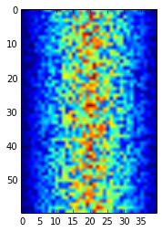
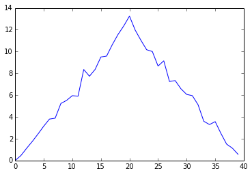

{: .objectives}
> ## Learning Objectives
>
> *  Displaying simple graphs
> *  Plotting data using matplotlib library
> *  Analysing data from multiple files

The mathematician Richard Hamming once said,
"The purpose of computing is insight, not numbers,"
and the best way to develop insight is often to visualize data.
Visualization deserves an entire lecture (or course) of its own,
but we can explore a few features of Python's `matplotlib` here.
While there is no "official" plotting library,
this package is the de facto standard.
First,
we will import the `pyplot` module from `matplotlib`
and use two of its functions to create and display a heat map of our data
from the previous topic:

{: .python}
~~~
from matplotlib import pyplot
pyplot.imshow(data)
pyplot.show()
~~~

pyplot keeps track of the graph as we are building it, so when we do `pyplot.show()` it's
just showing us what's been built so far.

Blue regions in this heat map are low values, while red shows high values.
As we can see, inflammation rises and falls over a 40-day period.

Note that if we try and run `pyplot.show()` again, the graph doesn't show. This is because
after it's been displayed, matplotlib *resets* and clears the current graph. To see it
again, we need to generate the plot again, e.g.:

{: .python}
~~~
pyplot.imshow(data)
pyplot.show()
~~~

Let's take a look at the average inflammation over time:

{: .python}
~~~
ave_inflammation = data.mean(axis=0)
pyplot.plot(ave_inflammation)
pyplot.show()
~~~

Here,
we have put the average per day across all patients in the variable `ave_inflammation`,
then asked `pyplot` to create and display a line graph of those values.
The result is roughly a linear rise and fall,
which is suspicious:
based on other studies,
we expect a sharper rise and slower fall.
Let's have a look at two other statistics:

{: .python}
~~~
pyplot.plot(data.max(axis=0))
pyplot.show()
~~~

{: .python}
~~~
pyplot.plot(data.min(axis=0))
pyplot.show()
~~~

The maximum value rises and falls perfectly smoothly,
while the minimum seems to be a step function.
Neither result seems particularly likely,
so either there's a mistake in our calculations
or something is wrong with our data.

It's very common to create an alias for a library when importing it
in order to reduce the amount of typing we have to do.
Here are our three plots side by side using aliases for `numpy` and `pyplot`:

{: .python}
~~~
import numpy as np
from matplotlib import pyplot as plt

data = np.loadtxt(fname='../data/inflammation-01.csv', delimiter=',')

fig = plt.figure(figsize=(10.0, 3.0))

axes1 = fig.add_subplot(1, 3, 1)
axes2 = fig.add_subplot(1, 3, 2)
axes3 = fig.add_subplot(1, 3, 3)

axes1.set_ylabel('average')
axes1.plot(data.mean(axis=0))

axes2.set_ylabel('max')
axes2.plot(data.max(axis=0))

axes3.set_ylabel('min')
axes3.plot(data.min(axis=0))

plt.show()
~~~

Running the above code (present under `code` directory in the file `three-plots.py`) may throw the warning as below. If you see the warning, please ignore it.

{: .error}
~~~
`/Users/user/anaconda/lib/python3.4/site-packages/matplotlib/tight_layout.py:225: UserWarning: tight_layout : falling back to Agg renderer
  warnings.warn("tight_layout : falling back to Agg renderer")`
~~~

`tight_layout` still works by falling back to a different way of generating the graph (the Agg renderer).

The call to `loadtxt` reads our data,
and the rest of the program tells the plotting library
how large we want the figure to be,
that we're creating three sub-plots,
and what to draw for each one.

{: .challenge}
> ## Make your own plot
>
> Create a plot showing the standard deviation of the inflammation data for each day across all patients.
> Hint: `data.std(axis=0)` gives you standard deviation.

{: .challenge}
> ## Moving plots around
>
> Modify the program to display the three plots on top of one another instead of side by side.

We now have almost everything we need to process all our data files.
The only thing that's missing is a library with a rather unpleasant name:

{: .python}
~~~
import glob
~~~

The `glob` library contains a single function, also called `glob`,
that finds files whose names match a pattern.
We provide those patterns as strings:
the character `*` matches zero or more characters,
while `?` matches any one character.
We can use this to get the names of all the HTML files in the current directory:

{: .python}
~~~
print(glob.glob('*.html'))
~~~

{: .output}
~~~
['01-numpy.html', '02-loop.html', '03-lists.html', '04-files.html', '05-cond.html', '06-func.html', '07-errors.html', '08-defensive.html', '09-debugging.html', '10-cmdline.html', 'index.html', 'LICENSE.html', 'instructors.html', 'README.html', 'discussion.html', 'reference.html']
~~~

{: .challange}
> Your output may have been different it depends on what folder you are in and what filetype you search for.
> Try using different filetypes and see what you find eg.
> {:. python}
> ~~~
> print(glob.glob('*.py'))
> ~~~

As these examples show,
`glob.glob`'s result is a list of strings,
which means we can loop over it
to do something with each filename in turn.
In our case,
the "something" we want to do is generate a set of plots for each file in our inflammation dataset.
Let's test it by analyzing the first three files in the list:

{: .python}
~~~
import glob

import numpy as np
from matplotlib import pyplot as plt

filenames = glob.glob('../data/inflammation-*.csv')
filenames.sort()
filenames = filenames[0:3]

for filename in filenames:
    print(filename)

    data = np.loadtxt(fname=filename, delimiter=',')

    fig = plt.figure(figsize=(10.0, 3.0))

    axes1 = fig.add_subplot(1, 3, 1)
    axes2 = fig.add_subplot(1, 3, 2)
    axes3 = fig.add_subplot(1, 3, 3)

    axes1.set_ylabel('average')
    axes1.plot(data.mean(axis=0))

    axes2.set_ylabel('max')
    axes2.plot(data.max(axis=0))

    axes3.set_ylabel('min')
    axes3.plot(data.min(axis=0))

    fig.tight_layout()
    plt.show()
~~~

{: .output}
~~~
inflammation-01.csv
~~~

{: .output}
~~~
inflammation-02.csv
~~~

{: .output}
~~~
inflammation-03.csv
~~~

Sure enough,
the maxima of the first two data sets show exactly the same ramp as the first,
and their minima show the same staircase structure;
a different situation has been revealed in the third dataset,
where the maxima are a bit less regular, but the minima are consistently zero.

## Saving our Plots

We can also save our plots to disk. Let's change our updated script to do that, by replacing `plt.show()` with `fig.savefig(filename)`. But what should we use for a filename each time? A quick way would be to just use the `filename` variable, and append a `.png` to it. This will tell matplotlib to save a generated graph as a PNG image file.

Let's do this now, e.g.:

{: .python}
~~~
import glob

import numpy as np
from matplotlib import pyplot as plt

filenames = glob.glob('../data/inflammation-*.csv')
filenames.sort()
filenames = filenames[0:3]

for filename in filenames:
    print(filename)

    data = np.loadtxt(fname=filename, delimiter=',')

    fig = plt.figure(figsize=(10.0, 3.0))

    axes1 = fig.add_subplot(1, 3, 1)
    axes2 = fig.add_subplot(1, 3, 2)
    axes3 = fig.add_subplot(1, 3, 3)

    axes1.set_ylabel('average')
    axes1.plot(data.mean(axis=0))

    axes2.set_ylabel('max')
    axes2.plot(data.max(axis=0))

    axes3.set_ylabel('min')
    axes3.plot(data.min(axis=0))

    fig.tight_layout()
    fig.savefig(filename + '.png')
~~~

If we rerun this script, we can see that our graphs have appeared as PNG files in the `data` directory, with the filenames `inflammation-XX.csv.png`.

Now we're satisfied that this works for a few inflammation datasets, we can now remove the `filenames = filenames[0:3]` statement, which will allow the script to work over all the inflammation datasets, which will also appear in the `data` directory.
