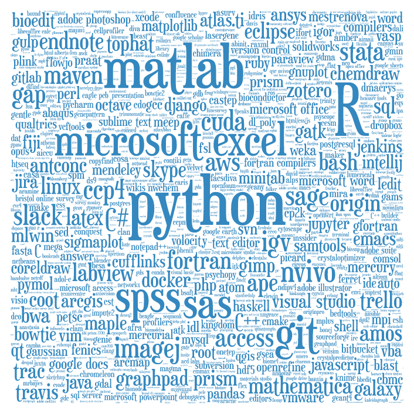
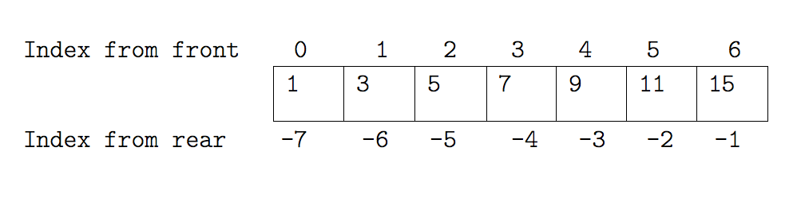
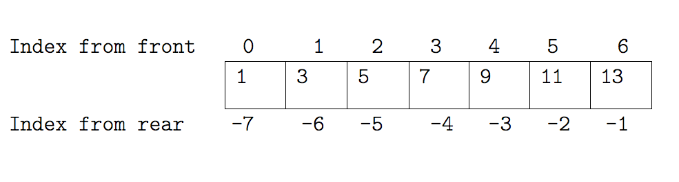
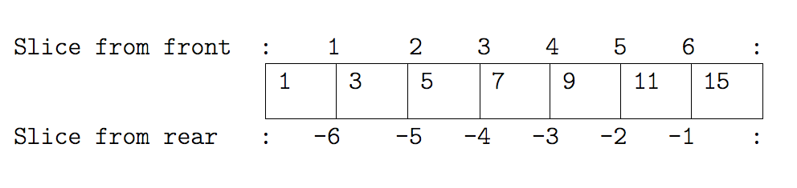
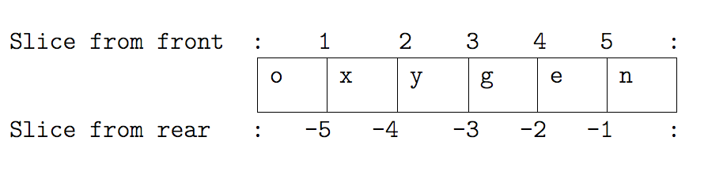
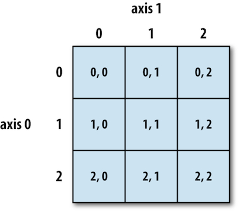

## Why Python?

- Free, well-documented, runs almost everywhere
- Large (and growing) user base among researchers and scientists
- Simple, readable, flexible, powerful language and easier for beginners to grasp
- Great for team working
    + Python aim - only one way to do something
    + Programs look very similar, easy for others to read
- Want to teach basic programming concepts that can be applied to other programming languages

## What can you use it for?

- Almost anything - it's general purpose!
- Used in many fields
     + Bioinformatics, Biology, Data visualisation, Engineering, Software development, etc.
- Used for processing data, general scripting, mapping, web applications, frameworks,
numerical processing, education, HPC, at Google, ...

## Python is up and coming!

- Based on Southampton PhD students software usage survey conducted by SSI's Policy researchers:
     

## We'll be teaching Python 3

- Python 3 is currently the standard version
- We'll teach using version 3!
- Python 3 has many advantages over Python 2
    + Many consistency improvements - removing redundancy
    + In places, simply more sensible e.g. integer division
    + Python 2 support will end in 2020
    + 'Short version: Python 2.x is legacy, Python 3.x is the present and future of the language'
- For new projects, seriously consider Python 3!

## Learning objectives

- how to assign values to variables, simple operations
- how to repeat actions with loops
- how to make choices using conditionals
- why we should divide programs into small, single-purpose blocks of code
- how to build a program, step by step, to do basic analysis on some climate data
- how we should analyse and fix errors in our programs
- how to read and analyse patient data using libraries
- how to visualise data using libraries

## Turning on Python Interpreter

- The interpreter provides an interactive environment to play with the language
- Mac/Linux: Open a terminal window and type **python3**
- Windows: Open **Git Bash**  and type **python**
- At the prompt type 'hello world!'
  

## Why indentation?

-  Studies show that's what people actually pay attention to
       + Every textbook on C or Java has examples where indentation and bracing don't match
-  Doesn't matter how much indentation you use, but the whole block must be consistent
-  Python Style Guide (PEP 8) recommends 4 spaces
-  And no tab characters

## Indexing a List Example I

## Indexing a List Example II

## Slicing a List Example I

## Slicing a List Example II

## NumPy Arrays

-  NumPy arrays and operations on arrays of data

   

## Indexing in a NumPy 2D array

- The indices are (row, column) instead of (column, row).
- Example Patient inflammation data who were given treatment for arthritis:
     + **Rows:** Hold information for a single patient
     + **Columns:**  Represent successive days

## Cont..

   

## Wrap-up Challenge: Connecting the dots

**Write a python script (function) for Fahrenheit to Celsius temperature conversion and stores the output in a file.**

- Hint (Tools to be used):
     + Unix pipes and filters
     + Python functions
     + Command-line programs
     + Using Fahr_to_kelvin() and Kelvin_to_celsius() functions

##  Thank You!
